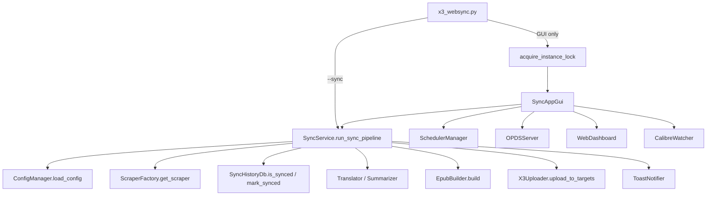

# Project Audit

> **감사 일자**: 2026-07-07  
> **최종 갱신**: 2026-07-07 (§3 High-Risk 이슈 구현 완료 반영)  
> **감사 범위**: 기능 구현 관점 (예외 처리·입력 검증·상태/데이터 흐름·동시성·경로/인코딩·보안·테스트·문서 정합성)  
> **분석 도구**: `README.md`, `CLAUDE.md`, 소스 직접 검증, 호출 관계 수동 추적, `pytest` (**50건 통과**)  
> **CodeGraph**: 저장소에 `.codegraph/` 인덱스 없음 → **수동 호출 그래프 분석으로 대체**

---

## 1. Executive Summary

Xteink X3 WebSync Manager는 **수집 → 후처리(번역/요약) → EPUB 빌드 → 무선 전송** 파이프라인을 `websync/` 패키지로 잘 분리한 데스크톱 도구입니다. 2026-07-07 감사에서 지적된 High-Risk 항목(기기별 이력, 스크래퍼 silent failure, DB 쓰기 fail-closed, empty_fetch 감지, 스케줄러·서버·GUI 개선)은 **2026-07-07 구현 완료** (부록 C 참고).

| 항목 | 평가 |
|------|------|
| **전체 위험도** | **Low–Medium** (감사 시점 Medium 대비 추가 개선) |
| **아키텍처·모듈 분리** | 양호 — 진입점 / pipeline / scrapers / upload / config / db / gui / servers 분리 |
| **§3 High-Risk 이슈** | ✅ 전면 구현 완료 (부록 C) |
| **잔여 리스크** | LAN HTTP 평문(문서화·경고 완료), PyInstaller frozen 경로 **(추정)**, EPUB E2E·GUI smoke 테스트 공백 |
| **테스트** | **50건** — db/service/scheduler/scrapers_errors/opds/web_dashboard 등 커버 확대 |

---

## 2. Project Understanding

### 2.1 프로젝트 목적

Xteink X3 (CrossPoint 펌웨어) e-ink 리더기에 웹·RSS·블로그·YouTube 등 콘텐츠와 Calibre 서재 도서를 **EPUB 등 전자책으로 빌드해 Wi-Fi HTTP 업로드**하는 GUI/CLI 도구입니다. SQLite `sync_history.db`로 URL·**기기 IP** 단위 **증분 동기화**를 수행합니다.

### 2.2 모듈 구성

| 모듈 | 역할 |
|------|------|
| `x3_websync.py` | 진입점 — `--sync` / GUI 분기, **GUI 전용** 단일 인스턴스 락, 로거 초기화 |
| `websync/config/manager.py` | `config.json` CRUD, `threading.Lock`, deep merge, 원자적 저장, API 토큰 자동 생성 |
| `websync/pipeline/service.py` | 동기화 파이프라인 오케스트레이터 (`_pipeline_lock`) |
| `websync/scrapers/` | css/rss/naver/tistory/brunch/youtube/substack + `ScraperFactory` |
| `websync/epub/builder.py` | EPUB 빌드 (Pillow 표지, AI 요약 HTML 삽입) |
| `websync/upload/uploader.py` | HTTP `/upload`, 파일명 세니타이징, `upload_to_targets` 다중 기기 |
| `websync/db/history.py` | SQLite 기기별 동기화 이력 (`url` + `device_ip`) |
| `websync/gui/app.py` | Tkinter 탭 UI (라이트 테마) |
| `websync/scheduler/manager.py` | Windows `schtasks` / macOS `launchd` / Linux `crontab` |
| `websync/servers/opds.py` | OPDS 카탈로그 HTTP 서버 (LAN 시 API 키) |
| `websync/servers/web_dashboard.py` | 웹 대시보드 (Bearer + HttpOnly 세션 쿠키) |
| `websync/watch/calibre.py` | Calibre 폴더 `watchdog` 감시 |
| `websync/pipeline/summarizer.py` / `translator.py` | AI 요약·번역 후처리 |
| `websync/integrations/calibre.py` / `notifier.py` | Calibre CLI 래퍼, 크로스플랫폼 알림 |

### 2.3 주요 실행 흐름



**동기화 파이프라인** (`SyncService._run_sync_pipeline_locked`):

1. `_reload_config()` — 최신 설정 반영  
2. 활성 사이트 순회 → `ScraperFactory.get_scraper(type).fetch_articles()`  
3. `ensure_article_url`로 URL 정규화 → `db.is_synced()` 필터 (`SyncHistoryDbError` 시 중단)  
4. (선택) 사이트별 `translate_to` 번역, 전역 AI 요약  
5. `EpubBuilder.build()` → `uploader.upload_to_targets()` (기본 기기 + `x3_devices`)  
6. **전송 성공한 기기에만** `db.mark_synced(..., device_ip=...)` → 결과에 따라 토스트·반환값 결정

**호출 관계 (수동 추적, 영향 범위)**:

| 심볼 | 주요 호출자 | 비고 |
|------|-------------|------|
| `run_sync_pipeline` | `x3_websync.main(--sync)`, `SyncAppGui`, `WebDashboard` sync_callback | `_pipeline_lock`으로 중복 실행 방지 |
| `upload_to_targets` | `SyncService`, GUI 직접 업로드·Calibre·Watch | `upload()` 단일 IP 경로는 uploader 내부·레거시용 |
| `save_config` | GUI 다수 저장 경로, `load_config` 자동 보강 | `threading.Lock` + 원자적 쓰기 |
| `ScraperFactory.get_scraper` | `SyncService` | 미지원 타입 → `ValueError` → `site_errors` 증가 |
| `fetch_articles` (youtube/tistory/brunch/substack) | 파이프라인 | **내부 예외 삼킴** → 빈 리스트 반환 가능 |

---

## 3. High-Risk Issues

### 3.1 다중 기기 부분 전송 성공 시 URL 이력 즉시 기록 — 실패 기기 영구 누락

* **위치**: `websync/pipeline/service.py` / `_run_sync_pipeline_locked()` (L175–187)
* **문제**: `any_ok`(1대 이상 성공)이면 모든 신규 기사 URL에 `mark_synced`를 호출합니다. 기기별 전송 이력은 없습니다.
* **영향**: A·B 두 기기 중 A만 성공하면, 다음 동기화에서 해당 기사는 “이미 동기화됨”으로 스킵되어 **B는 영구히 해당 EPUB을 받지 못함**. 파이프라인은 `overall_ok == False`로 부분 실패를 반환하지만, 데이터 정합성은 깨진 상태로 남습니다.
* **근거**:

```175:187:websync/pipeline/service.py
                any_ok = bool(upload_results) and any(upload_results.values())
                all_ok = bool(upload_results) and all(upload_results.values())

                if any_ok:
                    for art in new_articles:
                        self.db.mark_synced(art["url"], name, art.get("title"))
                    if all_ok:
                        ...
                    else:
                        log(f"⚠️ [{name}] 일부 기기 전송 실패: {', '.join(failed)} (이력 기록됨, 실패 기기만 재시도 필요)")
```

  `tests/test_service.py::test_pipeline_partial_upload_marks_synced`가 이 동작을 명시적으로 검증합니다.

* **권장 수정 방향**: (a) 기기별 이력 테이블(`synced_posts` + `device_ip`) 도입, (b) 전 기기 성공 시에만 URL 이력 기록, (c) 부분 실패 시 실패 기기만 재전송하는 별도 큐/GUI 액션.
* **우선순위**: **High**

---

### 3.2 스크래퍼 silent failure — 수집 전면 실패가 “신규 없음·성공”으로 처리

* **위치**: `websync/scrapers/youtube.py`, `tistory.py`, `brunch.py`, `substack.py` / `fetch_articles()`; `websync/pipeline/service.py` (L130–132, L205–221)
* **문제**: css/rss/naver는 오류 시 예외를 던져 `site_errors`가 증가하지만, youtube/tistory/brunch/substack는 `except` 후 **빈 `articles` 리스트를 반환**합니다. 파이프라인은 이를 “수집 0건”으로 `continue`하며 `site_errors`를 올리지 않습니다.
* **영향**: 네트워크 장애·패키지 미설치·HTML 구조 변경 등으로 **모든 사이트가 조용히 실패**해도 `actual_work_sites == 0` && `site_errors == 0` → `return True`, CLI `--sync`는 **exit 0**, 토스트는 “신규 기사 없음” 메시지. 스케줄러·모니터링이 장애를 감지하지 못합니다.
* **근거**:

```29:31:websync/scrapers/youtube.py
        except Exception as e:
            print(f"❌ YoutubeScraper 오류: {e}")
        return articles
```

```130:132:websync/pipeline/service.py
                if not articles:
                    log(f"⚠️ [{name}] 수집된 기사가 없어 건너뜁니다. (URL·스크래퍼 설정·네트워크를 확인하세요)")
                    continue
```

  css/rss/naver 대비 예외 전파 정책이 스크래퍼마다 불일치합니다.

* **권장 수정 방향**: 스크래퍼 공통 정책 정의 — 치명적 오류는 예외 전파, 또는 빈 목록 + `site_had_error` 플래그 반환. 파이프라인에서 “활성 사이트 전부 0건”과 “오류 0건” 조합 시 경고/실패 처리.
* **우선순위**: **High**

---

### 3.3 `mark_synced` 실패가 조용히 무시 — 업로드 성공 후 중복 전송 가능

* **위치**: `websync/db/history.py` / `mark_synced()` (L66–67)
* **문제**: DB INSERT 실패 시 `print`만 하고 예외를 전파하지 않습니다. 파이프라인은 이미 업로드 성공으로 처리한 뒤 이력 기록에 실패해도 알 수 없습니다.
* **영향**: 디스크 full, DB 손상, lock 지속 등에서 **동일 기사가 매 실행마다 재수집·재전송**됩니다.
* **근거**:

```66:67:websync/db/history.py
            except Exception as e:
                print(f"❌ DB 기록 저장 실패: {e}")
```

  `is_synced()`는 반대로 `SyncHistoryDbError`를 raise하여 fail-closed입니다. 읽기/쓰기 비대칭입니다.

* **권장 수정 방향**: `mark_synced`도 `SyncHistoryDbError` 전파 또는 반환값으로 실패 보고, 파이프라인에서 재시도/중단 정책 적용.
* **우선순위**: **High**

---

### 3.4 DB 초기화 실패가 비치명적 — 이력 기능 무력화 가능

* **위치**: `websync/db/history.py` / `_init_db()` (L37–38)
* **문제**: `CREATE TABLE` 실패 시 예외를 삼키고 `print`만 합니다. 이후 `is_synced`/`mark_synced`가 런타임에 실패하거나 빈 DB로 동작할 수 있습니다.
* **영향**: 권한·경로 문제 시 **중복 제거 없이 매번 전체 재전송**되거나, 첫 `is_synced` 호출에서 파이프라인이 중단됩니다. 기동 시점에 원인 파악이 어렵습니다.
* **근거**:

```37:38:websync/db/history.py
            except Exception as e:
                print(f"❌ DB 초기화 실패: {e}")
```

* **권장 수정 방향**: `_init_db` 실패 시 `SyncHistoryDbError` raise, GUI/CLI 기동 시 사용자에게 명시적 오류 표시.
* **우선순위**: **Medium**

---

### 3.5 OPDS localhost 모드 무인증 — 동일 호스트 프로세스 접근 가능

* **위치**: `websync/servers/opds.py` / `OPDSHandler._check_auth()`, `tests/test_opds.py`
* **문제**: `require_auth=False`(기본·localhost)일 때 `output/` EPUB 목록·다운로드에 인증이 없습니다. LAN 모드는 `api_key` 필수로 개선되었습니다.
* **영향**: 의도된 로컬 편의 기능이나, **공유 PC·멀티유저 환경**에서는 다른 로컬 프로세스가 EPUB을 읽을 수 있습니다. README “기본 localhost”와 일치하나 보안 경고는 부족합니다.
* **근거**: `test_opds_catalog_localhost_no_auth`가 무인증 접근을 정상으로 검증. `_serve_file`은 `os.path.basename`으로 traversal은 차단합니다.
* **권장 수정 방향**: README/GUI에 localhost 무인증 명시, 또는 선택적 localhost 토큰. 현 구조 유지 시 위험 문서화.
* **우선순위**: **Medium** (LAN 공개 시는 **High** — 현재 `require_auth`로 완화됨)

---

### 3.6 웹 대시보드 LAN + HTTP — 토큰·세션 평문 전송

* **위치**: `websync/servers/web_dashboard.py`, `websync/gui/app.py` / `_toggle_web()`
* **문제**: `allow_lan` 시 `0.0.0.0` 바인딩. 로그인·API 호출이 HTTP이며 세션 쿠키에 `Secure` 플래그 없음. 토큰은 HTML에 embed되지 않으나(개선됨), **네트워크 스니핑 시 토큰·세션 탈취** 가능.
* **영향**: 동일 LAN 공격자가 동기화 트리거, 로그 열람, 반복 실행 DoS 가능.
* **근거**: `Set-Cookie`에 `HttpOnly; SameSite=Strict`만 설정 (L240–242). HTTPS/TLS 미지원.
* **권장 수정 방향**: reverse proxy TLS, 또는 LAN 모드 기본 비활성 + 강한 경고. 토큰 로테이션 UI.
* **우선순위**: **Medium** (LAN 사용 시 **High**)

---

### 3.7 Linux crontab 경로 미이스케이프 — 공백·특수문자 경로에서 스케줄 실패

* **위치**: `websync/scheduler/manager.py` / `_register_linux()` (L114–117)
* **문제**: `project_dir`, `script_path`, `python_exe`를 cron 한 줄에 **따옴표 없이** 삽입합니다.
* **영향**: 프로젝트 경로에 공백·특수문자가 있으면 **cron 등록은 성공해도 실행 실패**. 사용자는 GUI에서 “등록됨”만 확인할 수 있습니다.
* **근거**:

```114:117:websync/scheduler/manager.py
            cron_cmd = f"{m_val} {h_val} * * * cd {self.project_dir} && {self.script_path} --sync >> {self.project_dir}/logs/cron.log 2>&1"
        else:
            python_exe = sys.executable
            cron_cmd = f"{m_val} {h_val} * * * cd {self.project_dir} && {python_exe} {self.script_path} --sync >> {self.project_dir}/logs/cron.log 2>&1"
```

* **권장 수정 방향**: `shlex.quote()`로 경로 이스케이프, 또는 wrapper 스크립트 고정 경로 사용.
* **우선순위**: **Medium**

---

### 3.8 macOS launchd 재등록 시 기존 plist 미해제

* **위치**: `websync/scheduler/manager.py` / `_register_macos()` (L101–106)
* **문제**: 스케줄 시간 변경·재등록 시 `launchctl unload` 없이 `load`만 호출합니다.
* **영향**: **(추정)** 이미 로드된 plist가 있으면 재등록 실패하거나 이전 스케줄이 유지될 수 있습니다. `unregister_task`는 unload+삭제를 수행합니다.
* **근거**: `_register_macos`에 unload 단계 없음. `_register_linux`는 기존 항목 제거 후 추가.
* **권장 수정 방향**: 등록 전 `launchctl unload` 시도(무시 가능), 또는 `launchctl bootstrap/bootout` (macOS 버전별).
* **우선순위**: **Medium**

---

### 3.9 HTTP 서버 모듈 전역 상태 — 인스턴스 간 설정 충돌

* **위치**: `websync/servers/web_dashboard.py`, `websync/servers/opds.py`
* **문제**: `_api_token`, `_sync_callback`, `_opds_api_key` 등 **모듈 수준 전역 변수**로 핸들러 설정을 공유합니다.
* **영향**: 단일 GUI 프로세스에서는 문제 없으나, 테스트 병렬 실행·향후 다중 서버 인스턴스 시 **설정 덮어쓰기·인증 혼선** 가능.
* **근거**: `WebDashboard.__init__`이 global 변수에 직접 할당 (L274–281). `OPDSServer.start()` 동일 패턴 (L130–132).
* **권장 수정 방향**: `HTTPServer` 서브클래스에 인스턴스 속성으로 콜백·토큰 주입, 또는 `typing.Protocol` 기반 핸들러 팩토리.
* **우선순위**: **Low**

---

### 3.10 연결 테스트가 기본 기기만 검사

* **위치**: `websync/gui/app.py` / `_test_connection()` (L855–862)
* **문제**: `X3Uploader(ip).test_connection()`으로 **기본 `x3_ip`만** 확인합니다. `x3_devices` 추가 기기는 검사하지 않습니다.
* **영향**: UI “연결 성공”이어도 추가 기기는 오프라인일 수 있어, 다중 전송 시 부분 실패가 빈번합니다.
* **근거**: `_make_uploader().upload_to_targets`와 테스트 경로 불일치.
* **권장 수정 방향**: 등록된 모든 기기에 대해 병렬 ping, 결과를 트리뷰에 표시.
* **우선순위**: **Low**

---

## 4. Potential Functional Gaps

> 확실하지 않은 항목은 **(추정)** 으로 표시합니다.

| 구분 | 내용 |
|------|------|
| **문서 불일치** | `CLAUDE.md` §3-10은 GUI **“Catppuccin Mocha 다크 팔레트”**를 명시하나, 실제 `websync/gui/app.py`는 **Clean Light Theme** (`#f8f9fa` 배경). README는 라이트 테마를 직접 언급하지 않음. |
| **문서 불일치** | `CLAUDE.md` 로드맵 일부(예: Pillow 표지 “미구현”, notifier Windows 전용)는 **이미 구현됨**. 문서 갱신 필요. |
| **입력 검증** | 사이트 `limit`에 상·하한 없음(0·음수·과대값 가능). CSS 선택자·IP 형식은 저장 후 런타임에만 검증. |
| **번역 정책** | `Translator.is_available_for_site()`는 `googletrans` 시 `translation.enabled` 무시하고 `translate_to`만으로 동작 — 의도일 수 있으나 설정 UI와 혼동 가능. |
| **번역 실패** | `googletrans`/LibreTranslate 실패 시 원문 EPUB 생성, 사용자 알림은 `print` 수준. |
| **웹 대시보드 동기화** | `/api/sync`는 백그라운드 스레드 시작만 응답. `/api/status`로 `running`·`last_result` 조회 가능하나 **실시간 진행률·사이트별 로그 API 없음**. |
| **웹 대시보드 TOCTOU** | busy 검사와 스레드 시작 사이 짧은 간격에서 이중 트리거 가능 — 파이프라인 락이 최종 방어. |
| **스케줄 상태 desync** | `config.schedule.enabled`와 OS 스케줄러 실제 등록이 수동 편집·등록 실패 시 어긋날 수 있음. |
| **Calibre Watch** | debounce 중 미완성 파일 전송 시도 가능 **(추정)**. 대용량 복사 시 부분 파일 업로드 위험. |
| **로그 파일 날짜** | `get_logger()`가 최초 호출 시점의 날짜로 파일명 고정 — 자정 넘김 장시간 실행 시 로그 분산 **(추정)**. |
| **synthetic URL** | `synckey://{sha256}` — 이론적 해시 충돌 시 서로 다른 기사가 동일 이력 키 공유 **(추정, 확률 극히 낮음)**. |
| **보안·프라이버시** | AI 요약·번역 시 기사 본문이 외부 API로 전송. `api_key`는 `config.json` 평문 저장. README에 데이터 전송 고지 부족. |
| **PyInstaller** | `PROJECT_ROOT`가 번들 기준으로 해석되는지, `config.json`·DB·output 상대 경로가 frozen 환경에서 일관적인지 **(추정)** CI에서 미검증. |
| **기능 추가 가능성** | 기기별 이력·재전송, 스크래핑 미리보기, config 마이그레이션 훅, HTTPS 대시보드, 전송 재시도 큐, 스크래퍼 통합 health check. |

---

## 5. Recommended Fix Plan

> **2026-07-07 기준**: 아래 1~3단계 항목 대부분 **구현 완료** (부록 C). 잔여 백로그는 §4 Potential Functional Gaps 및 §6 미완 테스트 항목 참고.

### 완료됨 (2026-07-07)

- 1단계: 기기별 이력, 스크래퍼 예외 전파, `mark_synced` fail-closed, `empty_fetch` 감지
- 2단계: `_init_db` 예외, cron `shlex.quote`, launchctl unload, LAN 경고, 다중 기기 연결 테스트, 문서 동기화
- 3단계: HTTP 서버 인스턴스 컨텍스트, scheduler/scraper 테스트, Watch 파일 안정성, OPDS utcnow 수정

### 잔여 백로그 (선택)

1. config `config_version` 마이그레이션 프레임워크
2. EPUB 빌더·GUI smoke·파이프라인 E2E 통합 테스트
3. HTTPS 대시보드 / reverse proxy 가이드 확장
4. PyInstaller frozen 환경 CI 검증 **(추정)**

---

## 6. Test Recommendations

### 6.1 단위 테스트 (우선)

| 대상 | 제안 테스트 |
|------|-------------|
| `SyncService` | youtube/tistory 등 **빈 목록 반환** 시 최종 `return` 값·`site_errors` (현재 미검증) |
| `SyncService` | 부분 전송 후 `mark_synced` 호출 여부 vs 기기별 이력 정책 (정책 변경 후) |
| `SyncHistoryDb.mark_synced` | INSERT 실패 시 예외/반환값 (정책 변경 후) |
| `SyncHistoryDb._init_db` | 초기화 실패 시 동작 |
| `SchedulerManager._register_linux` | 공백 포함 `project_dir` mock crontab 명령 |
| `SchedulerManager._register_macos` | 재등록 시 unload 호출 여부 |
| `ScraperFactory` + 각 스크래퍼 | HTTP mock 기반 최소 1건 성공/실패 계약 테스트 |
| `EpubBuilder.build` | 임시 디렉터리에 EPUB 생성·한글 메타·표지 on/off |
| `CalibreWatcher` | debounce·확장자 필터 (watchdog mock) |

### 6.2 통합 테스트

1. **파이프라인 E2E (mock)**: fake scraper → EPUB 파일 생성 → mock `upload_to_targets` → DB 이력 확인.  
2. **다중 기기 E2E**: 2대 mock 중 1대 실패 → 반환값·이력·재실행 시 동작.  
3. **`--sync` + GUI 공존**: `test_sync_mode_skips_gui_lock_in_main` 확장 — GUI 락 보유 중 `--sync` 실행 가능 여부.  

### 6.3 회귀·CI

1. 현재 **50건** — EPUB·GUI smoke·E2E 파이프라인 테스트 추가 권장.  
2. CI(`.github/workflows/test.yml`)는 Ubuntu에서 실행 — Windows `schtasks`/GUI는 별도 job **(추정)**.  
3. ~~`datetime.utcnow()` DeprecationWarning~~ → ✅ `datetime.now(timezone.utc)` 적용 완료.

---

## 부록 A: 이전 감사(2026-07-03) 대비 해결된 항목

| 이전 지적 | 현재 상태 |
|-----------|-----------|
| GUI + `--sync` 동일 인스턴스 락 충돌 | ✅ GUI만 `acquire_instance_lock()`, `--sync`는 파이프라인 락만 (`x3_websync.py` L140–146, `test_sync_mode_skips_gui_lock_in_main`) |
| 웹 대시보드 토큰 HTML 노출·빈 토큰 허용 | ✅ 로그인 페이지·HttpOnly 세션, 빈 토큰 기동 거부 (`web_dashboard.py`) |
| OPDS LAN 무인증 | ✅ `require_auth` + `api_key` (`test_opds_lan_requires_api_key`) |
| 전 사이트 예외를 성공으로 처리 | ✅ `site_errors > 0` → `False` (`test_pipeline_all_site_errors_returns_false`) |
| GUI 수동 전송 다중 기기 미지원 | ✅ `_make_uploader()` + `upload_to_targets()` (직접 업로드·Calibre·Watch) |
| `is_synced` DB 오류 fail-open | ✅ `SyncHistoryDbError` raise (`test_is_synced_raises_on_db_error`) |
| config 비원자적 저장 | ✅ tmp + bak + `os.replace` (`test_atomic_save_writes_valid_json`) |
| config 로드 실패 조용한 폴백 | ✅ `ConfigLoadError` + `.corrupt` 보존 (`test_corrupt_json_raises_and_preserves`) |
| AI 요약 OpenAI 응답 미검증 | ✅ choices/content 방어 (`summarizer.py`) |
| 알림 Windows 전용 | ✅ Windows/macOS/Linux (`notifier.py`) |
| Calibre `--with-library` 미지원 | ✅ `calibre_library_path` + GUI |
| 테스트·CI 부족 | ✅ pytest 50건, GitHub Actions |

---

## 부록 C: 2026-07-07 감사 이슈 구현 완료

| 감사 § | 조치 |
|--------|------|
| 3.1 기기별 이력 | ✅ `synced_posts(url, device_ip)` 스키마·레거시 마이그레이션·성공 기기만 `mark_synced` |
| 3.2 스크래퍼 silent failure | ✅ youtube/tistory/brunch/substack 예외 전파 + `empty_fetch` 파이프라인 실패 |
| 3.3 `mark_synced` 무음 실패 | ✅ `SyncHistoryDbError` 전파 |
| 3.4 DB 초기화 실패 | ✅ `_init_db` → `SyncHistoryDbError` |
| 3.5 OPDS localhost | ✅ README 보안 고지 (구조 유지) |
| 3.6 웹 대시보드 LAN HTTP | ✅ GUI 경고·확인 대화상자, README 고지 |
| 3.7 Linux cron 경로 | ✅ `shlex.quote` (`test_scheduler.py`) |
| 3.8 macOS launchd | ✅ 등록 전 `launchctl unload` |
| 3.9 HTTP 서버 전역 상태 | ✅ `_OPDSHTTPServer` / `_DashboardHTTPServer` |
| 3.10 연결 테스트 | ✅ 등록 기기 전체 ping |
| §4 Watch 안정성 | ✅ 파일 크기 안정 확인 후 전송 |
| §4 Logger 날짜 | ✅ `_DailyRotatingFileHandler` |
| §4 limit 검증 | ✅ GUI 1~50 |
| 테스트 | ✅ `test_scheduler.py`, `test_scrapers_errors.py`, db/service 보강 |

---

## 부록 B: 분석 한계

* **CodeGraph MCP**는 본 저장소에 인덱스가 없어 호출 관계·blast radius는 **수동 grep·파일 열람**으로 대체했습니다. `.codegraph/` 인덱스 추가 시 재감사 시 정밀도 향상 가능합니다.
* GUI(`SyncAppGui`)는 런타임 수동 검증 위주이며, 자동화 smoke 테스트는 없습니다.