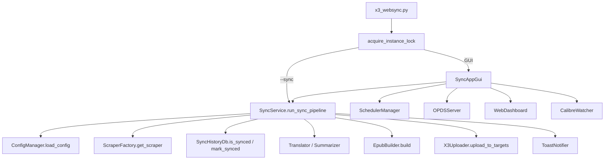

# Project Audit

> **감사 일자**: 2026-07-03  
> **감사 범위**: 기능 구현 관점 (예외 처리·입력 검증·상태/데이터 흐름·동시성·경로/인코딩·보안·테스트·문서 정합성)  
> **분석 도구**: `README.md`, `CLAUDE.md`, CodeGraph MCP (`codegraph_explore` — 호출 관계·blast radius), 소스 직접 검증, `pytest` (10건 통과)

---

## 1. Executive Summary

Xteink X3 WebSync Manager는 **수집 → 후처리(번역/요약) → EPUB 빌드 → 무선 전송** 파이프라인을 `websync/` 패키지로 잘 분리한 구조입니다. 이전 감사에서 지적되었던 PowerShell 인젝션 방어, `config.json` 락, SQLite timeout, 파이프라인 중복 실행 락, `include_images` 옵션, 다중 기기 파이프라인 전송 등은 **현재 코드에 반영**되어 있습니다.

그러나 **스케줄러와 GUI의 단일 인스턴스 락 충돌**, **LAN 공개 시 웹 대시보드/OPDS 무인증 노출**, **GUI 수동 전송 경로의 다중 기기 미지원**, **스크래핑 전면 실패를 ‘성공’으로 보고하는 파이프라인 반환값** 등이 여전히 실사용 시 기능 장애·보안·데이터 정합성 리스크로 남아 있습니다.

| 항목 | 평가 |
|------|------|
| **전체 위험도** | **Medium–High** |
| **아키텍처·모듈 분리** | 양호 (진입점 / pipeline / scrapers / upload / config / db 분리) |
| **이전 High 이슈 중 해결됨** | 파이프라인 락, notifier args 분리, config/db 락, stale instance lock, `maybe_strip_images` |
| **현재 최우선 리스크** | (1) GUI 실행 중 `--sync` 차단 (2) 웹 대시보드 토큰 HTML 노출 + LAN 무인증 (3) OPDS LAN 무인증 (4) 파이프라인 성공/실패 판정 부정확 (5) GUI 전송 경로 다중 기기 누락 |
| **테스트** | 10건 존재하나 **스크래퍼·서버·스케줄러·GUI·통합 파이프라인** 커버리지 부족 (CodeGraph: 핵심 심볼 대부분 “no covering tests”) |

---

## 2. Project Understanding

### 2.1 프로젝트 목적

Xteink X3 (CrossPoint 펌웨어) e-ink 리더기에 웹·RSS·블로그·YouTube 등 콘텐츠와 Calibre 서재 도서를 **EPUB 등 전자책으로 빌드해 Wi-Fi HTTP 업로드**하는 Windows 중심 GUI/CLI 도구입니다. SQLite `sync_history.db`로 URL 단위 **증분 동기화**를 수행합니다.

### 2.2 모듈 구성 (CodeGraph 기준, `websync/` 패키지)

| 모듈 | 역할 |
|------|------|
| `x3_websync.py` | 진입점 — `--sync` / GUI 분기, 단일 인스턴스 락, 로거 초기화 |
| `websync/config/manager.py` | `config.json` CRUD, `threading.Lock`, deep merge, API 토큰 자동 생성 |
| `websync/pipeline/service.py` | 동기화 파이프라인 오케스트레이터 (`_pipeline_lock`) |
| `websync/scrapers/` | css/rss/naver/tistory/brunch/youtube/substack + `ScraperFactory` |
| `websync/epub/builder.py` | EPUB 빌드 (Pillow 표지, AI 요약 HTML 삽입) |
| `websync/upload/uploader.py` | HTTP `/upload`, 파일명 세니타이징, `upload_to_targets` 다중 기기 |
| `websync/db/history.py` | SQLite 동기화 이력 |
| `websync/gui/app.py` | Tkinter 탭 UI |
| `websync/scheduler/manager.py` | Windows/macOS/Linux 스케줄 등록 |
| `websync/servers/opds.py` | OPDS 카탈로그 HTTP 서버 |
| `websync/servers/web_dashboard.py` | 웹 대시보드 (Bearer 토큰) |
| `websync/watch/calibre.py` | Calibre 폴더 `watchdog` 감시 |
| `websync/pipeline/summarizer.py` / `translator.py` | AI 요약·번역 후처리 |
| `websync/integrations/calibre.py` / `notifier.py` | Calibre CLI 래퍼, Windows 토스트 |

### 2.3 주요 실행 흐름



**동기화 파이프라인** (`SyncService._run_sync_pipeline_locked`):

1. `_reload_config()` — 최신 설정 반영
2. 활성 사이트 순회 → `ScraperFactory.get_scraper(type).fetch_articles()`
3. `ensure_article_url`로 URL 정규화 → `db.is_synced()` 필터
4. (선택) 사이트별 `translate_to` 번역, 전역 AI 요약
5. `EpubBuilder.build()` → `uploader.upload_to_targets()` (기본 기기 + `x3_devices`)
6. **모든 대상 기기 전송 성공 시에만** `db.mark_synced()` → 토스트 알림

**CodeGraph blast radius (핵심)**:

- `run_sync_pipeline` → GUI, CLI, WebDashboard `sync_callback` (4 callers)
- `upload_to_targets` → **pipeline만** 호출 (GUI 수동 전송은 `upload()` 단일 IP)
- `save_config` → GUI 11 callers, 테스트 없음
- `SchedulerManager`, `WebDashboard`, `CalibreWatcher`, scrapers → 테스트 없음

---

## 3. High-Risk Issues

### 3.1 GUI 실행 중 스케줄러 `--sync` 완전 차단

* **위치**: `x3_websync.py` / `acquire_instance_lock()`, `main()`
* **문제**: GUI와 `--sync` 모두 동일한 프로세스 락(`tempdir/x3_websync_instance.lock`)을 획득해야 기동됩니다. GUI가 떠 있는 동안 스케줄러가 `pythonw x3_websync.py --sync`를 실행하면 즉시 `sys.exit(1)`로 종료됩니다.
* **영향**: README·GUI의 “매일 자동 스케줄” 기능이 **사용자가 GUI를 상시 실행하는 일반적인 패턴에서 무력화**됩니다. 스케줄러는 실패로 기록되나 사용자에게는 “등록됨”으로 보일 수 있습니다.
* **근거**:

```131:134:x3_websync.py
    if not acquire_instance_lock():
        print(f"[{datetime.now()}] ⚠️ 경고: 이미 다른 X3 WebSync 프로그램 인스턴스가 실행 중입니다. 실행을 중단합니다.")
        sys.exit(1)
```

  스케줄러는 `--sync`만 호출 (`websync/scheduler/manager.py` `_register_windows`).

* **권장 수정 방향**: (a) GUI와 백그라운드 동기화의 락 정책 분리 — GUI는 “표시 인스턴스” 락, `--sync`는 파이프라인 락(`SyncService._pipeline_lock`)만 사용, 또는 (b) GUI 내에서 스케줄 트리거를 `SyncService.run_sync_pipeline`으로 위임.
* **우선순위**: **Critical**

---

### 3.2 웹 대시보드 — LAN 공개 시 토큰이 HTML에 노출·대시보드 페이지 무인증

* **위치**: `websync/servers/web_dashboard.py` / `_html_template()`, `DashboardHandler._check_auth()`, `do_GET()`
* **문제**:
  1. `GET /`, `/dashboard`는 **인증 없이** HTML을 제공합니다.
  2. HTML 내 `<script>`에 `API_TOKEN`이 **평문으로 삽입**됩니다 (`const API_TOKEN = ...`).
  3. `allow_lan=True` 시 `0.0.0.0` 바인딩 → 동일 네트워크 누구나 페이지를 열어 토큰을 획득 후 `/api/sync`, `/api/log` 호출 가능.
  4. `_check_auth()`는 `api_token`이 빈 문자열이면 **모든 요청을 허용**합니다.
* **영향**: 원격 동기화 트리거, 로그 열람(최근 100줄), DoS성 반복 동기화 가능.
* **근거**:

```79:86:websync/servers/web_dashboard.py
    def _check_auth(self) -> bool:
        if not _api_token:
            return True
        auth = self.headers.get("Authorization", "")
        if auth == f"Bearer {_api_token}":
            return True
```

```48:51:websync/servers/web_dashboard.py
const API_TOKEN = {token_js};
function authHeaders() {{
  return API_TOKEN ? {{'Authorization': 'Bearer ' + API_TOKEN}} : {{}};
```

* **권장 수정 방향**: LAN 모드에서도 (1) 대시보드 HTML 인증 필수, (2) 토큰을 JS에 넣지 않고 세션/쿠키 또는 최초 설정 시 1회 입력, (3) 빈 토큰 시 localhost만 허용 또는 기동 거부.
* **우선순위**: **Critical** (LAN 공개 사용 시) / **High** (localhost만 사용 시에도 빈 토큰 허용)

---

### 3.3 OPDS 서버 — 인증 없음, LAN 공개 시 출력 EPUB 전체 노출

* **위치**: `websync/servers/opds.py` / `OPDSHandler`, `OPDSServer`
* **문제**: OPDS·다운로드 엔드포인트에 **인증·속도 제한 없음**. `allow_lan` 시 `output/` 디렉터리 EPUB을 네트워크에 공개합니다.
* **영향**: 의도된 기능일 수 있으나, README “기본 localhost”와 달리 사용자가 LAN 체크 시 **개인 수집 콘텐츠 전체 유출** 가능.
* **근거**: `do_GET`에 인증 로직 없음. `_serve_file`은 `os.path.basename`으로 경로 탐색은 제한하나 인증은 없음.
* **권장 수정 방향**: LAN 모드에 API 키/기본 인증 추가, 또는 README에 보안 경고 명시 + 기본값 강화.
* **우선순위**: **High**

---

### 3.4 파이프라인 — 스크래핑 전면 실패와 “신규 기사 없음”을 동일한 성공으로 처리

* **위치**: `websync/pipeline/service.py` / `_run_sync_pipeline_locked()`
* **문제**: 사이트별 예외는 삼키고 `continue`합니다. `actual_work_sites == 0`이면 **무조건 `return True`** — 스크래핑 오류·네트워크 장애·설정 오류로 모든 사이트가 스킵된 경우에도 성공으로 처리됩니다.
* **영향**:
  - CLI `--sync`는 `sys.exit(0)` → 스케줄러/모니터링이 **실패를 감지 못함**
  - 토스트 “신규 기사 없어 전송 생략”이 **실제 오류 상황에서도** 표시됨
* **근거**:

```175:188:websync/pipeline/service.py
            except Exception as e:
                self.logger.exception(f"[{name}] 처리 중 오류: {e}")
                log(f"❌ [{name}] 처리 중 오류 발생: {e}")
        ...
        if actual_work_sites == 0:
            log("\n📊 작업 결과 요약: 모든 등록 사이트에 전송할 신규 포스트가 없습니다. (기기 전송 생략)")
            ...
            return True
```

* **권장 수정 방향**: 사이트별 `error_count` / `skipped_empty` / `no_new` 구분. 전 사이트 예외 시 `False` 반환. CLI exit code와 토스트 메시지 분리.
* **우선순위**: **High**

---

### 3.5 GUI 수동 전송 — 다중 기기 미지원 (문서·기대와 불일치)

* **위치**: `websync/gui/app.py` / `_direct_upload`, `_send_calibre_books`, `_toggle_watch` (`on_new_file`)
* **문제**: README “다중 X3 기기 동시 전송”을 명시하나, 파이프라인 외 경로는 `X3Uploader(ip).upload()`로 **기본 `x3_ip` 단일 기기만** 전송합니다. `upload_to_targets()`는 `SyncService`에서만 사용됩니다 (CodeGraph 확인).
* **영향**: 추가 기기 등록 후 Calibre 전송·직접 업로드·Watch 자동 전송은 **추가 기기로 가지 않음**.
* **근거**: `grep X3Uploader(` → GUI 4곳 모두 단일 IP `upload()`.
* **권장 수정 방향**: GUI 전송 경로를 `upload_to_targets()`로 통일하고 결과를 로그/토스트에 기기별 표시.
* **우선순위**: **High**

---

### 3.6 DB 조회 실패 시 `is_synced` → False — 중복 전송 가능

* **위치**: `websync/db/history.py` / `is_synced()`
* **문제**: DB 예외 시 `False` 반환 → “미동기화”로 간주되어 **동일 기사 재수집·재전송** 가능.
* **영향**: `database is locked`, 디스크 오류, 손상 DB 상황에서 중복 EPUB 전송 및 이력 불일치.
* **근거**:

```45:47:websync/db/history.py
            except Exception as e:
                print(f"⚠️ DB 조회 실패: {e}")
                return False
```

* **권장 수정 방향**: 실패 시 예외 전파 또는 “unknown” 상태로 파이프라인 중단/재시도. 최소한 로그 레벨 `error` + 사용자 알림.
* **우선순위**: **High**

---

### 3.7 `config.json` 저장 — 원자적 쓰기 없음

* **위치**: `websync/config/manager.py` / `_save_config_unlocked()`
* **문제**: 직접 `open(w)` + `json.dump` — 프로세스 크래시·전원 차단 시 **빈/깨진 config.json** 가능.
* **영향**: 다음 기동 시 `load_config` 예외 → 기본값 폴백(아래 3.8)으로 **사용자 설정 유실**.
* **근거**: temp 파일 + `os.replace` 패턴 없음.
* **권장 수정 방향**: atomic write + 필요 시 백업 `.bak`.
* **우선순위**: **Medium**

---

### 3.8 설정 로드 실패 시 조용한 기본값 폴백

* **위치**: `websync/config/manager.py` / `load_config()`
* **문제**: JSON 파싱/IO 예외 시 `DEFAULT_CONFIG` deep copy 반환. **손상 파일을 수정·알리지 않음**.
* **영향**: 사용자는 설정이 “초기화”된 것처럼 동작하나 원인 파악 어려움. GUI 자동 저장(`FocusOut`)과 겹치면 손상 설정을 **정상 설정으로 덮어쓸** 위험.
* **근거**:

```166:168:websync/config/manager.py
            except Exception as e:
                print(f"⚠️ 설정 로드 실패: {e}. 기본값을 사용합니다.")
                return copy.deepcopy(self.DEFAULT_CONFIG)
```

* **권장 수정 방향**: 로드 실패 시 GUI/CLI에서 명시적 오류, `config.json.corrupt` 보존.
* **우선순위**: **Medium**

---

### 3.9 AI 요약 — OpenAI 응답 구조 검증 없음

* **위치**: `websync/pipeline/summarizer.py` / `_call_openai()`
* **문제**: `result["choices"][0]["message"]["content"]` 직접 접근 — 비정상 응답 시 `KeyError`/`IndexError`로 요약 단계 실패. 상위 `summarize()`는 빈 문자열 폴백하나 **해당 기사 요약만 누락**.
* **영향**: 부분 기능 저하, 로그에 stack trace (`summarize` except는 `print`만).
* **근거**: `_call_openai`에 응답 스키마 검증 없음.
* **권장 수정 방향**: 응답 검증 + `logger.warning` + 기사별 skip.
* **우선순위**: **Medium**

---

### 3.10 알림 — Windows 전용, 크로스플랫폼 스케줄러와 불일치

* **위치**: `websync/integrations/notifier.py` / `ToastNotifier.show_toast()`
* **문제**: PowerShell `NotifyIcon`만 사용. README는 macOS/Linux 스케줄러를 지원한다고 하나 **동기화 결과 알림은 Windows에서만** 동작합니다.
* **영향**: macOS/Linux 스케줄 `--sync` 실행 시 실패/성공을 사용자가 놓침.
* **근거**: `subprocess.Popen(["powershell", ...])`만 존재.
* **권장 수정 방향**: `plyer` 등 추상화 또는 플랫폼별 no-op + 로그 강조 (CLAUDE.md 로드맵 O항).
* **우선순위**: **Medium**

---

### 3.11 다중 기기 부분 전송 성공 시 이력 미기록 — 재시도 시 중복 전송

* **위치**: `websync/pipeline/service.py` (L165–170), `websync/upload/uploader.py` / `upload_to_targets()`
* **문제**: `upload_ok = all(upload_results.values())` — **한 기기라도 실패하면** `mark_synced` 전체 스킵. 성공한 기기에는 이미 EPUB이 전달됨.
* **영향**: 재동기화 시 성공한 기기에 **동일 EPUB 중복 전송**. 사용자는 “실패”로 인지하나 일부 기기에는 이미 반영됨.
* **근거**: 부분 성공에 대한 per-device 이력·멱등 처리 없음.
* **권장 수정 방향**: 기기별 전송 이력 또는 부분 성공 시에도 URL 이력 기록(정책 선택) + 실패 기기만 재전송 UI.
* **우선순위**: **Medium**

---

## 4. Potential Functional Gaps

> 확실하지 않은 항목은 **(추정)** 으로 표시합니다.

| 구분 | 내용 |
|------|------|
| **문서 불일치** | `CLAUDE.md`는 GUI “Catppuccin 다크 테마”, 락 경로 `/tmp/x3_websync_instance.lock`, 구 플랫 파일명(`gui.py`, `service.py`) 기준. 실제는 **라이트 테마**(`websync/gui/app.py`), 락은 `tempfile.gettempdir()`, **`websync/` 패키지 구조**. |
| **문서 불일치** | `CLAUDE.md` 설정 스키마에 `x3_devices`, `opds_server`, `web_dashboard` 등 누락. README는 최신에 가깝습니다. |
| **입력 검증** | 사이트 URL·CSS 선택자·`limit`에 대한 서버측/저장 전 검증 없음. 잘못된 URL은 런타임 예외로만 드러남. |
| **Calibre 라이브러리 경로** | `CalibreManager`는 `calibredb.exe`만 받음. **(추정)** 다중 라이브러리 사용자는 기본 라이브러리만 조회될 수 있음 (`--with-library` 미지원). |
| **YouTube 스크래퍼** | `maybe_strip_images` import만 있고 자막 HTML에는 미적용 — 영향 낮음. `youtube-transcript-api` 미설치 시 빈 목록 반환(사용자 메시지는 print만). |
| **번역** | `googletrans`는 사이트별 `translate_to`만으로 동작 가능하나, 네트워크·Rate limit 실패 시 **원문 그대로 EPUB** 생성 — 사용자 알림 약함. |
| **웹 대시보드 동기화** | `/api/sync`는 백그라운드 스레드 시작만 응답. **실제 성공/실패·진행률을 API로 조회 불가** (추정: 운영 시 재실행·중복 요청 가능성). |
| **OPDS 설정 동기화** | `config.opds_server.bind_host` 필드는 있으나 GUI는 `allow_lan` 체크박스만 사용. **저장된 `bind_host`와 UI 상태 불일치 가능** (추정). |
| **스케줄 상태** | `config.schedule.enabled`와 OS 스케줄러 실제 등록 상태가 **수동 편집·실패 시 desync** 가능. GUI는 `get_task_status()`만 표시. |
| **인스턴스 락 (Windows)** | 비정상 종료 시 stale lock 복구 로직 있음 (`_remove_stale_lock`). **강제 종료 직후 PID 재사용** (추정) 극히 드문 오판 가능. |
| **synthetic URL** | `ensure_article_url` 해시 16자 — **(추정)** 이론적 충돌 시 서로 다른 기사가 동일 이력 키 공유 가능. |
| **보안** | `Summarizer`/`Translator`가 외부 API로 기사 본문 전송 — API 키는 `config.json` 평문 저장. README에 명시 없음. |
| **테스트 공백** | 7종 스크래퍼, EPUB 빌더 통합, OPDS/웹 서버, 스케줄러, GUI, instance lock — **테스트 없음** (CodeGraph blast radius). |
| **기능 추가 가능성** | 기기별 연결 상태 사전 점검, 전송 큐/재시도, 스크래핑 결과 미리보기, config 스키마 버전 마이그레이션, PyInstaller 번들 경로에서 `PROJECT_ROOT` 검증. |

---

## 5. Recommended Fix Plan

### 1단계 — 즉시 수정 (기능 장애·보안)

1. **인스턴스 락 정책 분리**: GUI 상시 실행 + 스케줄 `--sync` 공존 가능하게 설계 변경.
2. **웹 대시보드 보안**: LAN 모드 토큰 HTML 노출 제거, 빈 토큰 시 API 거부, 대시보드 GET 인증.
3. **파이프라인 exit semantics**: 전 사이트 오류 vs 신규 없음 구분, CLI exit code 정확화.
4. **GUI 전송 경로 다중 기기 통일**: `upload_to_targets()` 적용.

### 2단계 — 안정성 개선

1. `config.json` atomic save + 로드 실패 시 corrupt 파일 보존·사용자 알림.
2. `is_synced` DB 오류 처리 — fail-closed 또는 재시도.
3. 다중 기기 부분 전송 시 이력/재시도 정책 정의.
4. OPDS LAN 모드 경고 또는 인증 추가.
5. `Summarizer`/`OpenAI` 응답 방어 코드.
6. 크로스플랫폼 알림 추상화 (또는 문서에 Windows 전용 명시).

### 3단계 — 구조·품질 개선

1. `CLAUDE.md`를 `websync/` 패키지 구조·현재 GUI·락 경로·설정 스키마에 맞게 갱신.
2. 스크래퍼·서버·스케줄러 통합 테스트 추가.
3. 웹 대시보드 동기화 상태 API (`/api/status`) 및 WebSocket/폴링 **(추정 필요 시)**.
4. Calibre `--with-library` 설정 지원 **(추정)**.
5. config 스키마 버전 필드 + 마이그레이션.

---

## 6. Test Recommendations

### 6.1 단위 테스트 (우선)

| 대상 | 제안 테스트 |
|------|-------------|
| `x3_websync.acquire_instance_lock` | stale lock 제거, 중복 기동 거부, GUI+sync 정책 변경 후 **공존 시나리오** |
| `SyncService._run_sync_pipeline_locked` | 전 사이트 예외 → `False`, 신규 없음 → `True`, 부분 업로드 실패 시 `mark_synced` 여부 |
| `X3Uploader.upload_to_targets` | mock HTTP로 다중 기기 성공/부분 실패/전부 실패 |
| `ConfigManager` | atomic save 검증, corrupt JSON 로드 동작, `save_config` 동시 호출 |
| `SyncHistoryDb.is_synced` | DB 예외 시 동작 (정책 결정 후) |
| `web_dashboard.DashboardHandler` | 토큰 없음/LAN, Bearer 검증, `/api/sync` busy 응답 |
| `opds.OPDSHandler` | path traversal 시도, 비-epub 거부 |
| `SchedulerManager` | hour/minute 검증, 등록 명령 mock (플랫폼별) |
| `Summarizer._call_openai` | malformed JSON mock |
| `ScraperFactory` | 미지원 타입 `ValueError` |

### 6.2 통합 테스트

1. **파이프라인 E2E (mock)**: fake scraper → EPUB 파일 생성 → mock upload → DB 이력 확인.
2. **다중 기기 E2E**: 2대 mock 기기 중 1대 실패 시 반환값·DB 상태.
3. **GUI smoke** (optional): `SyncAppGui` init without mainloop (mock `SyncService`).

### 6.3 회귀·CI

1. `pytest` 최소 30건 목표 (현재 10건).
2. `requirements.txt` optional deps를 extra로 분리하고, core 테스트는 optional 없이 통과하도록 마커 사용 (`pytest -m "not optional"`).
3. PR 시 `python -m pytest tests/ -q` 필수화 **(추정: CI 미구성 시 GitHub Actions 추가)**.

---

## 부록: 이전 감사 대비 변경 사항

| 이전 지적 | 현재 상태 |
|-----------|-----------|
| 파이프라인 중복 실행 | ✅ `SyncService._pipeline_lock` + `tests/test_service.py` |
| `include_images` 미구현 | ✅ `maybe_strip_images` — css/rss/naver/tistory/brunch/substack/naver 적용 |
| 다중 기기 파이프라인 | ✅ `upload_to_targets` (GUI 수동 경로는 미적용) |
| PowerShell 인젝션 | ✅ `$args` 분리 (`notifier.py`) |
| 테스트 전무 | △ 10건 존재, 커버리지는 여전히 좁음 |
| 웹 대시보드 무인증 | △ Bearer 있으나 HTML 노출·빈 토큰·GET 무인증 문제 잔존 |

---

---

## 7. 조치 완료 (2026-07-03 구현)

| 감사 항목 | 조치 |
|-----------|------|
| 3.1 GUI+`--sync` 락 충돌 | ✅ GUI만 `acquire_instance_lock()`, `--sync`는 파이프라인 락만 |
| 3.2 웹 대시보드 보안 | ✅ 로그인 페이지·HttpOnly 세션, 토큰 HTML 미노출, 빈 토큰 기동 거부, `/api/status` |
| 3.3 OPDS LAN 무인증 | ✅ `require_auth` + `api_key` (X-Api-Key / Bearer / query) |
| 3.4 파이프라인 성공 판정 | ✅ 전 사이트 오류 → `False`, 신규 없음 → `True` 구분 |
| 3.5 GUI 다중 기기 미지원 | ✅ `_make_uploader()` + `upload_to_targets()` 통일 |
| 3.6 `is_synced` fail-open | ✅ `SyncHistoryDbError` 예외 전파 |
| 3.7 config 원자적 저장 | ✅ tmp+bak+`os.replace` |
| 3.8 설정 로드 실패 | ✅ `ConfigLoadError` + `.corrupt` 보존 |
| 3.9 AI 요약 응답 검증 | ✅ choices/content 방어 |
| 3.10 크로스플랫폼 알림 | ✅ Windows/macOS/Linux (`notifier.py`) |
| 3.11 부분 전송 이력 | ✅ 1대 이상 성공 시 `mark_synced`, pipeline은 부분 실패 시 `False` |
| Calibre `--with-library` | ✅ `calibre_library_path` 설정 + GUI |
| 테스트·CI | ✅ pytest **39건**, GitHub Actions, `requirements-optional.txt` |
| 문서 | ✅ `CLAUDE.md` 갱신 |

*초기 감사(분석 전용) 이후 위 항목이 코드에 반영되었습니다.*