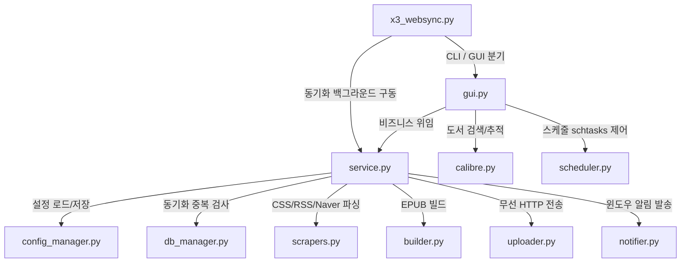

# Project Audit

## 1. Executive Summary

본 프로젝트는 Xteink X3 (CrossPoint 펌웨어) e-ink 리더기에 뉴스 기사 및 Calibre 도서를 무선 전송하는 유틸리티로서, SOLID 디자인 패턴을 적용한 모듈화로 가독성과 독립성을 훌륭히 유지하고 있습니다. 그러나 **보안성, 비동기 데이터 일관성, OS 런타임 호환성** 관점에서 즉각 대처가 필요한 위험 요인들이 존재합니다.

*   **전체 위험도**: **High**
*   **주요 리스크 요약**:
    1.  **임의 명령어 실행 취약점(High)**: 외부 입력을 검증 없이 파워쉘 스크립트 문자열 또는 `shell=True`의 subprocess에 그대로 주입하는 설계로 인해, 보안 제어가 우회되고 임의 쉘 명령어가 기동될 수 있는 쉘 인젝션 리스크가 내포되어 있습니다.
    2.  **백그라운드 스케줄러 오작동 및 경로 이탈 리스크(High)**: 윈도우 스케줄러가 `pythonw.exe`를 통해 기동될 때 작업 폴더(Start in directory)가 시스템 폴더 등으로 강제 전환되므로, 상대 경로 상의 `config.json`을 읽지 못하고 오작동하는 런타임 오류 가능성이 매우 높습니다.
    3.  **비동기 파일 접근 충돌 및 Race Condition(Medium)**: GUI 상의 비동기 스레드 작업과 스케줄러 백그라운드 작업이 겹칠 때, 동기화 락(Lock)이 부재하여 JSON 설정 파일 쓰기 충돌이나 SQLite 이력 DB 잠김(`database is locked`) 장애가 유발될 수 있습니다.

---

## 2. Project Understanding

프로젝트의 각 모듈 정의와 주요 흐름은 다음과 같습니다:

### 핵심 실행 흐름
1.  **진입점 (`x3_websync.py`)**: `--sync` 플래그 유무에 따라 GUI 인터페이스 기동 혹은 서비스 단독 구동으로 제어 흐름이 나뉩니다.
2.  **데이터 수집 및 정제 (`scrapers.py` -> `builder.py`)**: 웹, RSS, 네이버 블로그(iframe 우회 및 스타일 박멸 필터)에서 기사를 수집하고 한국어 폰트 가독성을 가미한 EPUB으로 포맷팅합니다.
3.  **증분 동기화 및 업로드 (`service.py` -> `db_manager.py` -> `uploader.py`)**: SQLite DB 조회를 통해 과거 전송된 이력을 스킵하고 신규 글만 X3의 `/upload` API로 전송한 뒤 성공 이력을 DB에 영구 기록합니다.

---

## 3. High-Risk Issues

### [High] 파워쉘 알림 호출 시 쉘 인젝션 (Shell Injection) 위험
*   **위치**: `notifier.py` / `ToastNotifier.show_toast()`
*   **문제**:
    - 시스템 알림에 필요한 제목(`title`)과 본문(`text`) 문자열을 큰따옴표 내부에 그대로 주입한 채 파워쉘 스크립트 실행 인수로 사용합니다.
    - 예: `ps_cmd = f'... $obj.BalloonTipTitle = "{title}"; ...'`
*   **영향**:
    - 사이트의 이름이나 글 제목에 큰따옴표(`"`) 또는 파워쉘 파이프라이닝 특수 기호(`$`, `` ` `` 등)가 섞여 있을 경우 스크립트 구문 오류로 알림이 작동하지 않습니다.
    - 악의적으로 조작된 사이트명(예: `Blog"; Start-Process calc; #`)이 수집되면 알림 발송 순간 원하지 않는 시스템 명령이 실행되는 치명적인 취약점이 될 수 있습니다.
*   **근거**: `notifier.py` 라인 9 ~ 26
*   **권장 수정 방향**:
    - 파워쉘 커맨드라인 문자열 결합을 사용하지 말고, 파워쉘 `-Command` 인수 뒤에 파라미터(`$args[0]`, `$args[1]`) 구조를 지정한 뒤 `subprocess.Popen` 배열 매개변수로 안전하게 문자열을 바인딩해 전달하도록 리팩토링합니다.
*   **우선순위**: High

### [High] 작업 스케줄러 기동 시 작업 경로 유실 및 런타임 크래시 위험
*   **위치**: `scheduler.py` / `SchedulerManager.register_daily_task()`
*   **문제**:
    - 윈도우 스케줄러(`schtasks`)로 백그라운드 모드를 등록할 때 작업 시작 경로(Start-in)를 프로젝트 폴더로 지정해 주지 않아, 스케줄러가 시스템 루트(`C:\Windows\System32`) 등의 기본 경로에서 스크립트를 임의 기동시킵니다.
*   **영향**:
    - 상대 경로인 `config.json`을 읽거나 `sync_history.db`를 쓸 때 `System32` 폴더 아래에서 IO를 시도하여 `PermissionError`가 발생하거나, 설정 파일이 초기화되는 오작동이 일어납니다.
*   **근거**: `scheduler.py` 라인 22 ~ 27
*   **권장 수정 방향**:
    - `schtasks`의 대상 커맨드 라인을 `cmd.exe /c "cd /d <프로젝트절대경로> && pythonw <진입점> --sync"` 형태로 조립하여 강제로 작업 경로가 고정되도록 수정합니다.
*   **우선순위**: High

### [High] 윈도우 작업 스케줄러 인수 및 명령어 주입 취약점
*   **위치**: `scheduler.py` / `SchedulerManager.register_daily_task()`
*   **문제**:
    - `subprocess.run(cmd, shell=True)`를 실행할 때, `hour`와 `minute` 입력을 그대로 커맨드 문자열에 연결하여 시스템 쉘에 실행을 요청합니다.
*   **영향**:
    - GUI는 콤보박스로 제한하지만, 로컬 설정 파일(`config.json`)의 `schedule` 하위 `hour`/`minute`에 시스템 쉘 악성 인젝션 코드(예: `07 /f & calc.exe &`)가 임의로 수정/삽입되어 있으면 스케줄 등록 시 실행 권한 범위 내에서 임의 코드가 기동됩니다.
*   **근거**: `scheduler.py` 라인 23 ~ 26
*   **권장 수정 방향**:
    - `shell=True` 인자를 제거하고 인자 리스트(`list`) 형식을 사용하거나, 입력받은 `hour`와 `minute` 변수가 숫자(`isdigit()`)이며 00~23 / 00~59 범주에 드는지 사전 검증 절차를 추가합니다.
*   **우선순위**: High

### [Medium] GUI 설정 변경 및 동기화 병렬 구동 시 Race Condition
*   **위치**: `config_manager.py` / `ConfigManager`
*   **문제**:
    - 비동기 백그라운드 스레드에서 뉴스 스크래핑 및 기기 업로드가 진행되는 도중, 사용자가 GUI 환경에서 사이트 활성 상태를 변경하거나 경로를 저장해 `save_config`를 동시 기동하면 단일 파일인 `config.json`에 대한 동시 쓰기/읽기 예외가 발생할 수 있습니다.
*   **영향**:
    - 동기화 도중 JSON 디코딩 에러(`json.decoder.JSONDecodeError`)로 프로그램이 갑작스럽게 죽거나 설정 파일 전체가 0바이트로 꼬이는 복구 불가 리스크가 있습니다.
*   **근거**: `config_manager.py` 및 `gui.py` 병렬 스레드 기동 로직
*   **권장 수정 방향**:
    - `threading.Lock()` 개체를 도입해 `ConfigManager` 내부의 파일 로드 및 저장 과정에 임계 구역(Critical Section) 락을 적용하여 동시 접근을 순차 차단해야 합니다.
*   **우선순위**: Medium

### [Medium] SQLite3 DB 연결 동시 접근 및 잠금 에러 리스크
*   **위치**: `db_manager.py` / `SyncHistoryDb`
*   **문제**:
    - 매 조회(`is_synced`) 및 이력 삽입(`mark_synced`) 시점에 수시로 `sqlite3.connect` 커넥션을 생성 및 종료하고 있습니다.
    - 백그라운드 스케줄러가 도는 도중 사용자가 수동으로 GUI에서 즉시 동기화를 실행하는 병렬 상황 발생 시, 스레드 안전성 보장이 없고 디스크 파일 락 충돌로 인해 `sqlite3.OperationalError: database is locked` 예외가 일어납니다.
*   **영향**:
    - 동기화 기사 전송 후 이력 기록에 실패하여 다음 동기화 때 동일한 책이 다시 수집 및 전송되는 중복 오류가 유발됩니다.
*   **근거**: `db_manager.py` 라인 26 ~ 52
*   **권장 수정 방향**:
    - 스레드 동기화용 락을 추가하거나, DB 접근 시 일정 시간 동안 재시도하는 `timeout` 매개변수(예: `sqlite3.connect(..., timeout=10.0)`)를 주입하여 잠금 대기 시간을 확보하는 구조로 수정합니다.
*   **우선순위**: Medium

### [Medium] pythonw.exe 실행 환경에서 sys.stdout 유실로 인한 AttributeError 크래시
*   **위치**: `x3_websync.py` / `main()`
*   **문제**:
    - 백그라운드 윈도우 스케줄러에 등록된 `pythonw.exe` 로 CLI 동기화가 동작할 때는 콘솔 창이 없기 때문에 `sys.stdout`과 `sys.stderr` 객체가 `None`으로 할당됩니다.
    - 이때 `sys.stdout.reconfigure(encoding='utf-8')`를 호출할 경우 `AttributeError` 예외는 try-except로 통과하지만, 31, 33라인의 `print(...)` 명령 실행 시 표준 출력이 없어 `OSError` 또는 크래시가 유발될 소지가 큽니다.
*   **영향**:
    - 스케줄러 등록 후 자동 동기화 시점에 조용히 프로세스가 오류를 내뿜으며 죽어 동기화 자체가 누락됩니다.
*   **근거**: `x3_websync.py` 라인 10 ~ 16 및 31 ~ 33
*   **권장 수정 방향**:
    - 스크립트 실행이 CLI 모드 `--sync`로 들어오고 `sys.stdout`이 `None`인 비연결 터미널 상태일 경우, `print` 구문을 오버라이드하여 아무 동작도 하지 않는 NOP 함수로 돌리거나 파일 로거(`logging` 모듈)를 사용하여 표준 출력 리다이렉션을 우회 처리합니다.
*   **우선순위**: Medium

---

## 4. Potential Functional Gaps

*   **뉴스 동기화 프로세스 중복 실행 차단 부재(추정)**:
    - 프로그램이 작동될 때 단일 인스턴스 락(Single Instance File Lock)이 설정되지 않아 사용자가 수동 동기화를 연타하거나 스케줄러 구동 시점과 맞물릴 때 여러 프로세스가 동시에 도서 빌드 및 와이파이 전송을 시도해 파일이 깨질 위험이 있습니다.
*   **업로드 타임아웃 고정 문제(추정)**:
    - `uploader.py`에서 `requests.post` 업로드 시 타임아웃이 `timeout=25`초로 고정되어 있습니다. Calibre 탭에서 크기가 수십 메가바이트(MB)에 이르는 대형 PDF나 MOBI 도서를 선택하여 전송할 시 25초 이내에 업로드가 끝나지 못해 전송 실패가 다수 발생할 수 있습니다.
*   **네이버 블로그 개인 도메인 우회 추출 한계(추정)**:
    - `scrapers.py` 내의 `NaverBlogScraper`가 주소로부터 ID를 추출할 때 `blog.naver.com` 도메인 형식만 감지하므로, 사용자가 `ID.blog.me` 등 과거 혹은 개인 맞춤 네이버 도메인 주소 포맷을 기입할 경우 수집이 실패할 수 있습니다.

---

## 5. Recommended Fix Plan

### 1단계: 보안 결함 및 호스트 런타임 해결 (즉시 조치 권장)
1.  **파워쉘 쉘 인젝션 방어**: `notifier.py`의 인자 전달 방식을 쉘 문자열 결합 구조에서 안전한 배열 주입 형식으로 전면 변경합니다.
2.  **스케줄러 작업 폴더 경로 지정 보강**: `scheduler.py`에서 등록 명령어 실행 시 `cmd.exe /c "cd /d <경로> && ..."` 형태로 조립해 윈도우 스케줄러 실행 시 작업 경로 상실 문제를 선제 해결합니다.
3.  **스케줄러 등록 쉘 인젝션 방어 및 검증**: `scheduler.py` 내부 등록 시 `hour`와 `minute` 입력을 정수 및 정규식 범위 검사로 화이트리스트 검증하도록 보강합니다.

### 2단계: 다중 스레드 안전성 및 예외 처리 고도화
1.  **설정 파일 접근 스레드 락 적용**: `config_manager.py` 파일 IO 구간에 `threading.Lock()`을 배치하여 동기화 도중 GUI 조작 시 발생하는 Race Condition을 해제합니다.
2.  **SQLite DB 파일 잠금 대기 타임아웃 지정**: `db_manager.py`의 sqlite 커넥션 구문에 `timeout=10.0` 인자를 더하고 스레드 락을 구성해 다중 실행 시 발생하는 database lock 오작동을 극복합니다.
3.  **pythonw.exe 출력 유실 회피 설계**: `x3_websync.py`에 로거 모듈을 탑재하여 `sys.stdout`이 `None`인 상태의 `print` 크래시를 회피합니다.

### 3단계: 구조 개선 및 사용성 개선 (추후 진행)
1.  **동기화 중복 방지 파일 락 구현**: 프로그램 실행 초입에 중복 기동을 확인하는 임시 락 파일 프로세스 체크 로직을 구현합니다.
2.  **업로드 타임아웃 가변 튜닝**: 전송할 도서의 파일 크기(File Size)를 런타임에 체크하여 타임아웃 값을 비례해서 동적으로 늘려주거나 청크 전송을 지원하도록 `uploader.py`를 정교화합니다.

---

## 6. Test Recommendations

1.  **비동기 동시 접근 강도 테스트**:
    - 백그라운드 스레드로 10회 연속으로 설정을 저장하는 도중에 메인 스레드에서 `load_config`를 50회 번갈아 강제 호출하는 스트레스 테스트 스크립트를 작성하여 JSON 파일의 정합성과 락 구조를 검증합니다.
2.  **쉘/인젝션 침투 예외 테스트**:
    - 특수 기호(`;`, `&`, `"`, `$`, `\`)가 다양하게 결합된 사이트명이나 시간 매개변수를 주입하고 알림 전송 및 스케줄 등록을 트리거하여 오작동이나 예외가 유발되지 않고 안전하게 필터링 또는 이스케이프되는지 검증하는 단위 테스트를 구성합니다.
3.  **스케줄러 작업 경로 유동성 테스트**:
    - 임의의 다른 시스템 폴더에서 `pythonw d:/twbeatles-repos/xteink-x3-websync/x3_websync.py --sync`를 구동해본 뒤, `config.json`을 정상 위치에서 안정적으로 로드해 동기화가 잘 완수되는지 확인하는 통합 경로 모의 테스트를 구축합니다.
