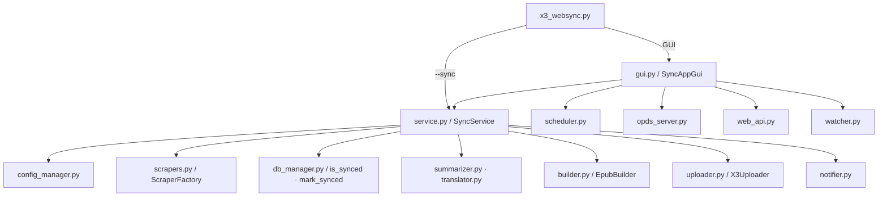

# Project Audit

> **감사 일자**: 2026-07-03  
> **조치 완료**: 2026-07-03 — §5 권장 수정 계획 1~3단계 핵심 항목 코드 반영 완료 (테스트 10건 통과)  
> **감사 범위**: 기능 구현 관점 (보안·동시성·데이터 흐름·문서 정합성)  
> **분석 도구**: README.md, CLAUDE.md, CodeGraph MCP (`codegraph_explore` 호출 관계·blast radius), 소스 직접 검증

---

## 1. Executive Summary

Xteink X3 WebSync Manager는 **수집 → EPUB 빌드 → 무선 전송** 파이프라인을 모듈별로 잘 분리한 구조이며, 이전 감사에서 지적된 PowerShell 인젝션·스케줄러 경로·`config.json` 락·SQLite timeout·`pythonw` stdout·로그 파일·단일 인스턴스 락 등은 **현재 코드에 반영되어 있음**을 확인했습니다.

그러나 코드베이스가 CLAUDE.md 로드맵의 상당 부분(다중 스크래퍼, OPDS, 웹 대시보드, AI 요약, 번역, Calibre Watch 등)까지 확장된 상태에서, **기능 연결 누락·동시 실행 제어 부재·네트워크 서비스 무인증 노출**이 새로운 핵심 리스크입니다.

| 항목 | 평가 |
|------|------|
| **전체 위험도** | **Medium–High** |
| **아키텍처·모듈 분리** | 양호 (SOLID 지향, 팩토리·서비스 레이어 명확) |
| **이전 High 이슈** | 대부분 수정 완료 (notifier, scheduler, config/db 락, logger) |
| **현재 최우선 리스크** | (1) 동기화 파이프라인 중복 실행 (2) `include_images` 미구현 (3) 웹 대시보드 무인증 LAN 노출 (4) Windows 락 파일 잔존 (5) 다중 기기 업로드·이력 기록 불일치 |
| **테스트** | 단위·통합 테스트 **전무** (CodeGraph: 모든 핵심 심볼에 "no covering tests found") |

---

## 2. Project Understanding

### 2.1 프로젝트 목적

Xteink X3 (CrossPoint 펌웨어) e-ink 리더기에 뉴스·블로그·RSS 등 웹 콘텐츠와 Calibre 서재 도서를 **EPUB 등 전자책 형태로 빌드·무선 전송**하는 Windows 중심 GUI/CLI 유틸리티입니다. SQLite(`sync_history.db`)로 전송 이력을 관리해 **증분 동기화**를 수행합니다.

### 2.2 모듈 구성 (CodeGraph 기준)

| 모듈 | 역할 |
|------|------|
| `x3_websync.py` | 진입점 — CLI `--sync` / GUI 분기, 단일 인스턴스 락, 로거 초기화 |
| `config_manager.py` | `config.json` CRUD, `threading.Lock`, 결손 키 보강 |
| `service.py` | 동기화 파이프라인 오케스트레이터 |
| `scrapers.py` | CSS / RSS / Naver / Tistory / Brunch / YouTube / Substack 스크래퍼 + `ScraperFactory` |
| `builder.py` | EPUB 빌드 (Pillow 표지, AI 요약 삽입) |
| `uploader.py` | HTTP `/upload` 전송, 파일명 세니타이징, 가변 타임아웃, 다중 기기 병렬 전송 |
| `db_manager.py` | SQLite 동기화 이력 (조회·삭제·전체 초기화) |
| `gui.py` | Tkinter 탭 UI (동기화·Calibre·이력·OPDS·웹·Watch·AI/번역 설정) |
| `scheduler.py` | Windows/macOS/Linux 스케줄 등록 (`cd /d` 경로 고정, 입력 검증) |
| `notifier.py` | PowerShell 토스트 (`$args` 분리형 안전 구현) |
| `logger.py` | `logs/sync_YYYY-MM-DD.log` 회전 로그 |
| `summarizer.py` / `translator.py` | AI 요약·번역 후처리 |
| `opds_server.py` / `web_api.py` | OPDS 카탈로그·웹 대시보드 HTTP 서버 |
| `watcher.py` | Calibre 폴더 `watchdog` 감시 |
| `calibre.py` | `calibredb.exe` 래퍼 |

### 2.3 주요 실행 흐름

**동기화 파이프라인** (`run_sync_pipeline`):

1. `_reload_config()` — 최신 설정 반영
2. 활성 사이트 순회 → `ScraperFactory.get_scraper(type).fetch_articles()`
3. `db.is_synced(url)` 필터 → 신규 기사만 EPUB 빌드
4. (선택) 번역·AI 요약 → `EpubBuilder.build()`
5. `uploader.upload()` (+ `x3_devices` 있으면 `upload_to_all_devices()`)
6. 성공 시 `db.mark_synced()` → 토스트 알림

### 2.4 이전 감사 대비 개선 확인 (수정 완료)

| 이전 이슈 | 현재 상태 |
|-----------|-----------|
| PowerShell 문자열 인젝션 (`notifier.py`) | `$args[0/1/2]` + `subprocess.Popen` 리스트 인자로 **수정됨** |
| 스케줄러 작업 경로 유실 | `cmd.exe /c "cd /d {project_dir} && ..."` **수정됨** |
| `shell=True` / 시간 인젝션 | `shell=False`, `isdigit()`·범위 검증 **수정됨** |
| `config.json` Race Condition | `ConfigManager._lock` **수정됨** |
| SQLite `database is locked` | `_db_lock` + `timeout=10.0` **수정됨** |
| `pythonw` stdout `None` 크래시 | `NullWriter` + `logging` **수정됨** |
| 고정 25초 업로드 타임아웃 | 파일 크기 기반 가변 타임아웃 **수정됨** |
| 단일 인스턴스 미구현 | `tempfile` 락 파일 **구현됨** |
| 동기화 로그 파일 없음 | `logger.py` **구현됨** |

---

## 3. High-Risk Issues

### 3.1 동기화 파이프라인 중복 실행 (프로세스 내)

* **위치**: `service.py` / `SyncService.run_sync_pipeline()`, `gui.py` / `_run_immediate_sync()`, `web_api.py` / `DashboardHandler.do_POST()`
* **문제**: 파이프라인 수준의 실행 락이 없습니다. GUI는 버튼을 `disabled` 하지만, 웹 대시보드 `POST /api/sync`는 별도 스레드로 `run_sync_pipeline()`을 즉시 기동하며, GUI 동기화와 **동시 실행**될 수 있습니다. 동일 프로세스 내에서 SQLite·EPUB 파일·기기 업로드가 겹칩니다.
* **영향**: `database is locked` 재발 가능, 동일 날짜 EPUB 덮어쓰기, 기기에 중복 전송, `mark_synced` 타이밍 꼬임.
* **근거**: `gui.py` 979–986행(스레드 기동), `web_api.py` 111–115행(인증·락 없이 스레드 기동). CodeGraph blast radius: `run_sync_pipeline` — GUI·CLI 3 callers, 테스트 없음.
* **권장 수정 방향**: `threading.Lock` 또는 `asyncio` 세마포어로 파이프라인 단일 실행 보장. 웹/GUI 모두 락 획득 실패 시 "이미 실행 중" 응답.
* **우선순위**: **High**

---

### 3.2 `include_images` 설정이 스크래퍼에 전달되지 않음 (기능 미구현)

* **위치**: `service.py` 84–114행, `scrapers.py` 전 스크래퍼 (`CssSelectorScraper` 79–81행 등)
* **문제**: `service.py`에서 `include_images = site.get("include_images", False)`를 읽지만 스크래퍼에 전달하지 않습니다. 모든 스크래퍼가 **무조건** `img.decompose()`로 이미지를 제거합니다. GUI 사이트 다이얼로그의 "이미지 포함" 체크박스는 동작하지 않습니다.
* **영향**: 사용자 설정과 실제 EPUB 내용 불일치. CLAUDE.md 로드맵 항목 I가 **부분 구현(설정·UI만)** 상태.
* **근거**: `service.py` 113–114행 주석만 존재, `scrapers.py`에 `include_images` 참조 없음 (CodeGraph 탐색 확인).
* **권장 수정 방향**: `site_config["include_images"]`를 스크래퍼에서 분기 처리하거나, `service.py` 후처리 단계에서 이미지 제거 여부 결정.
* **우선순위**: **High**

---

### 3.3 웹 대시보드·OPDS 서버 무인증 LAN 노출

* **위치**: `web_api.py` / `WebDashboard.start()` (141행), `opds_server.py` / `OPDSServer.start()` (95행)
* **문제**: 두 서버 모두 `HTTPServer(("", port), ...)`로 **모든 네트워크 인터페이스**에 바인딩됩니다. 웹 대시보드는 `POST /api/sync`로 동기화를 원격 트리거하고, `GET /api/log`로 최근 로그 100줄을 노출합니다. 인증·토큰·IP 화이트리스트가 없습니다.
* **영향**: 동일 LAN의 임의 클라이언트가 동기화 남용, 로그 정보 유출, OPDS로 EPUB 목록·다운로드 가능.
* **근거**: `web_api.py` 77–121행, `opds_server.py` 90–96행.
* **권장 수정 방향**: 기본 `127.0.0.1` 바인딩, API 키 또는 Basic Auth, 설정으로 LAN 공개 opt-in.
* **우선순위**: **High**

---

### 3.4 Windows 단일 인스턴스 락 파일 잔존 (크래시 후 재기동 불가)

* **위치**: `x3_websync.py` / `acquire_instance_lock()`, `release_instance_lock()`
* **문제**: Windows에서 `os.O_CREAT | os.O_EXCL`로 락 **파일 존재 자체**가 중복 실행을 막습니다. 프로세스가 `finally` 전에 비정상 종료되면 락 파일이 남아 이후 모든 기동이 `sys.exit(1)`됩니다. PID·stale 검사 로직이 없습니다.
* **영향**: 크래시·강제 종료 후 앱을 다시 열 수 없음. 스케줄러 `--sync`도 동일 락을 사용하면 연쇄 실패 가능.
* **근거**: `x3_websync.py` 40–55행, 57–70행 (`os.remove`는 정상 종료 시에만).
* **권장 수정 방향**: 락 파일에 PID·타임스탬프 기록 후 stale 판별, 또는 Windows `msvcrt`/named mutex 사용.
* **우선순위**: **High**

---

### 3.5 다중 기기 업로드와 이력 기록 불일치

* **위치**: `service.py` 131–147행, `uploader.py` / `upload()`, `upload_to_all_devices()`
* **문제**:
  1. `x3_devices`가 있으면 `upload()`(기본 기기) 후 `upload_to_all_devices()`를 추가 호출합니다. 후자는 기본 기기를 목록에 다시 포함하므로 **기본 기기에 이중 업로드**됩니다.
  2. `mark_synced`는 `upload_ok`(기본 기기 단일 결과)만 기준으로 합니다. 추가 기기 전송 실패 시에도 이력이 기록됩니다.
* **영향**: 기기 중복 수신, 일부 기기 미수신인데 재전송 불가(이력 기록됨).
* **근거**: `service.py` 132–146행, `uploader.py` 58–66행.
* **권장 수정 방향**: 단일 코드 경로로 통합(`devices` 비어 있으면 기본만, 있으면 `upload_to_all_devices`만). 모든 대상 성공 시에만 `mark_synced`, 또는 기기별 이력 분리.
* **우선순위**: **High**

---

### 3.6 중복 감지 키로 `title` 폴백 사용

* **위치**: `service.py` 101–104행, 145–146행
* **문제**: `art.get("url") or art.get("title")`로 동기화 키를 결정합니다. RSS에서 `url`이 빈 문자열인 경우(`scrapers.py` `RssScraper` 127행), CSS 스크래퍼에서 링크 없을 때 목록 URL이 동일한 경우 등 **서로 다른 기사가 동일 키**를 공유할 수 있습니다.
* **영향**: 신규 기사 누락(이미 동기화된 것으로 오판) 또는 URL 없는 기사가 제목 충돌로 스킵.
* **근거**: `service.py` 103행, `scrapers.py` 67–70행·127행.
* **권장 수정 방향**: URL 필수 검증, 없으면 `urljoin`·해시 기반 synthetic URL 생성, title 단독 키 금지.
* **우선순위**: **Medium**

---

### 3.7 GUI 로그 콜백 클로저 지연 바인딩

* **위치**: `gui.py` / `_run_immediate_sync()` 981행, `_toggle_web()` 924행
* **문제**: `log_callback=lambda msg: self.root.after(0, lambda: self._log_message(msg))` 패턴은 `after` 실행 시점에 `msg`가 마지막 값으로 고정되는 **클로저 버그**가 있습니다.
* **영향**: 동기화 중 로그 메시지 누락·중복·잘못된 내용 표시.
* **근거**: `gui.py` 981행. (Calibre 전송 등은 `lambda p=file_path:` 기본 인자로 올바르게 처리됨 — 664–669행)
* **권장 수정 방향**: `lambda msg: self.root.after(0, lambda m=msg: self._log_message(m))`
* **우선순위**: **Medium**

---

### 3.8 EPUB XHTML에 수집 HTML·제목 무이스케이프 삽입

* **위치**: `builder.py` / `EpubBuilder.build()` 141–156행
* **문제**: `art['title']`, `art['content']`, `summary_html`을 f-string으로 XHTML에 직접 삽입합니다. `html.escape` 없음. 스크래핑된 HTML에 `</body>` 등이 포함되면 EPUB 구조 손상 가능.
* **영향**: EPUB 뷰어 파싱 실패, 일부 리더에서 스크립트·태그 주입(리더 구현 의존).
* **근거**: `builder.py` 147–155행. AI 요약도 `summarizer.py` 62행에서 API 응답을 이스케이프 없이 HTML 삽입.
* **권장 수정 방향**: 제목은 `html.escape`, 본문은 Bleach/sanitize 또는 XHTML fragment 파서 사용.
* **우선순위**: **Medium**

---

### 3.9 상대 경로 기반 설정·DB·출력 경로

* **위치**: `config_manager.py` 75행 (`config_path="config.json"`), `db_manager.py` 9행 (`sync_history.db`), `builder.py` / `output_dir`
* **문제**: 경로가 CWD 상대 경로입니다. 스케줄러는 `cd /d`로 보완하지만, 사용자가 다른 폴더에서 `python x3_websync.py`를 실행하면 **프로젝트 외부**에 config/db/output이 생성됩니다.
* **영향**: 설정 분실, 이력 DB 분리, 스케줄러와 GUI가 서로 다른 DB 사용.
* **근거**: `config_manager.py` 75–76행, `scheduler.py` 38–44행(스케줄만 절대경로 보장).
* **권장 수정 방향**: `__file__` 기준 프로젝트 루트를 기본 경로로 고정.
* **우선순위**: **Medium**

---

### 3.10 `config.json` 중첩 키 보강 불완전

* **위치**: `config_manager.py` / `load_config()` 88–100행
* **문제**: 최상위 키와 `schedule` 하위만 결손 보강합니다. `ai_summary`, `translation`, `opds_server`, `sites[].include_images` 등 **중첩 객체·배열 항목**은 기존 config에 키가 없으면 `KeyError` 또는 기본값 미적용 가능.
* **영향**: 구버전 config 사용자가 AI/번역/사이트 옵션에서 예외 또는 기본 동작 불일치.
* **근거**: `config_manager.py` 88–100행 — `schedule`만 특별 처리.
* **권장 수정 방향**: `DEFAULT_CONFIG` 대비 재귀적 deep merge.
* **우선순위**: **Medium**

---

### 3.11 사이트별 번역과 전역 `translation.enabled` 불일치

* **위치**: `service.py` 116행, `translator.py` 16–17행, `gui.py` 사이트 다이얼로그
* **문제**: GUI는 사이트별 `translate_to`를 설정하지만, 실제 번역은 `Translator.is_available()` → **전역** `translation.enabled`가 True여야 실행됩니다. 사이트만 설정하고 전역 번역을 켜지 않으면 무동작.
* **영향**: 사용자 혼란, "번역 설정했는데 안 됨" UX 문제.
* **근거**: `service.py` 116–119행, `translator.py` 16–17행.
* **권장 수정 방향**: `translate_to`가 비어 있지 않으면 사이트 수준에서 번역 활성 간주, 또는 GUI에 의존 관계 안내.
* **우선순위**: **Medium**

---

### 3.12 `x3_devices` 다중 기기 — 설정만 존재, GUI 없음

* **위치**: `config_manager.py` 11행, `service.py` 29·40행, `gui.py` (관리 UI 없음)
* **문제**: 다중 기기 스키마와 `upload_to_all_devices()`는 구현됐으나 GUI에서 기기 목록을 편집할 수 없습니다. `config.json` 수동 편집 필요.
* **영향**: README/CLAUDE가 암시하는 기능이 일반 사용자에게 접근 불가.
* **근거**: CodeGraph — `x3_devices`는 `service.py`에서만 참조, `gui.py`에 매칭 없음.
* **권장 수정 방향**: GUI에 기기 목록 추가/삭제/테스트 연결 UI.
* **우선순위**: **Medium**

---

### 3.13 동기화 이력 Treeview `iid=url`

* **위치**: `gui.py` / `_refresh_history()` 857–859행
* **문제**: Tk `Treeview`의 `iid`에 전체 URL을 사용합니다. URL에 특수문자·길이 제한이 있으면 삽입 실패 또는 선택/삭제 오동작 가능.
* **영향**: 이력 탭에서 항목 표시·삭제 실패.
* **근거**: `gui.py` 858행 `iid=url`.
* **권장 수정 방향**: 순번·해시 기반 `iid`, URL은 values 컬럼에만 저장.
* **우선순위**: **Low**

---

### 3.14 업로드 MIME 타입 고정

* **위치**: `uploader.py` 38행
* **문제**: PDF·MOBI·TXT 전송 시에도 `Content-Type: application/epub+zip`으로 전송합니다.
* **영향**: CrossPoint 펌웨어가 MIME을 검증하면 비-EPUB 전송 실패 가능 (추정).
* **근거**: `uploader.py` 37–38행.
* **권장 수정 방향**: 확장자별 `mimetypes.guess_type()` 적용.
* **우선순위**: **Low**

---

## 4. Potential Functional Gaps

### 문서와 구현 불일치 (확인됨)

| 문서 | 실제 구현 | 갭 |
|------|-----------|-----|
| `README.md` — CSS/RSS 위주 | 7종 스크래퍼, AI·번역·OPDS·웹·Watch | README가 **대폭 뒤처짐** |
| `README.md` — `pip install` 4종 | Pillow·googletrans·youtube-transcript-api·watchdog 선택 의존 | 의존성 목록 불완전 |
| `README.md` — Windows 스케줄러만 언급 | `scheduler.py` macOS launchd·Linux crontab 지원 | 크로스플랫폼 미기재 |
| `CLAUDE.md` — 로드맵 A~Q 다수 "미구현" | logger, 이력 탭, OPDS, 웹, Watch, Tistory 등 **이미 구현** | CLAUDE.md 로드맵 **미갱신** |
| `CLAUDE.md` — `PROJECT_AUDIT.md` "이미 반영 완료" | 본 감사 기준 신규 이슈 다수 존재 | 감사 문서 **재작성 필요** (본 파일) |

### 기능·안정성 갭

* **동기화 파이프라인 전역 락 부재** (확인됨): §3.1 참조.
* **`include_images` 미연결** (확인됨): §3.2 참조.
* **당일 EPUB 파일명 충돌** (추정): `{site}_{YYYY-MM-DD}.epub` 고정명으로 하루 2회 동기화 시 이전 EPUB 덮어쓰기. 재전송·부분 실패 시 복구 어려움.
* **Tistory/Brunch/YouTube/Substack 조용한 실패** (확인됨): 예외 시 빈 `articles` 반환 → "기사 비어있어 건너뜀"만 표시, 원인 구분 어려움.
* **Calibre Watch 중복 이벤트** (추정): `on_created`만 처리, 복사 완료 전 이벤트·다중 이벤트에 대한 debounce 없음 → 동일 파일 반복 전송 가능.
* **AI 요약 전역 on/off만** (확인됨): 사이트별 요약 on/off 없음. `Summarizer.is_available()`이 전역 `ai_summary.enabled`만 확인.
* **`requirements.txt` 부재** (확인됨): 선택 의존성 포함한 고정 버전 목록 없음 → 재현 가능한 설치 환경 보장 어려움.
* **테스트 부재** (확인됨): CodeGraph가 모든 핵심 심볼에 covering test 없음 보고.
* **`.gitignore`에 `sync_history.db`·`logs/` 미포함** (확인됨): 로컬 DB·로그가 실수로 커밋될 수 있음 (현재 git status에 `logs/` untracked).

### 이미 해결되어 더 이상 High가 아닌 항목 (참고)

* PowerShell 인젝션, 스케줄러 경로/인젝션, config/db 락, pythonw stdout, 고정 업로드 타임아웃, 네이버 `blog.me` 지원 — **현재 코드에서 해결 확인**.

---

## 5. Recommended Fix Plan

### 1단계: 즉시 수정 (기능 오동작·보안)

1. **파이프라인 실행 락** — `SyncService`에 `threading.Lock` 추가, GUI·웹·CLI 공통 적용.
2. **`include_images` 스크래퍼 연동** — 설정값이 실제 EPUB에 반영되도록 구현.
3. **다중 기기 업로드 로직 정리** — 이중 업로드 제거, 성공 기준·`mark_synced` 조건 통일.
4. **웹/OPDS 기본 localhost 바인딩** + 동기화 API 인증(최소 토큰).
5. **Windows stale 락 파일 복구** — PID 기반 stale 검사.

### 2단계: 안정성·데이터 정합성

1. **프로젝트 루트 기준 절대 경로** — config, DB, output, logs.
2. **`config.json` deep merge** — 중첩 설정·사이트 항목 결손 키 보강.
3. **동기화 키 정책** — URL 필수화, title 폴백 제거.
4. **GUI 로그 콜백 클로저 수정** — `lambda m=msg` 패턴.
5. **EPUB HTML sanitize** — 제목 이스케이프, 본문 안전 삽입.
6. **번역/요약 UX** — 사이트 `translate_to`와 전역 enabled 관계 정리 또는 자동 활성.

### 3단계: 구조·문서·확장

1. **`x3_devices` GUI** — 다중 기기 관리 탭.
2. **`requirements.txt`** — 필수·선택 의존성 분리 기재.
3. **README·CLAUDE.md 동기화** — 구현된 기능·모듈 목록 갱신, 로드맵 완료 항목 체크.
4. **Calibre Watch debounce** — 파일 안정화 후 단일 전송.
5. **당일 EPUB 버전 suffix** (추정 필요 시) — `_v2` 타임스탬프 등.
6. **테스트 스위트 도입** — §6 참조.

---

## 6. Test Recommendations

현재 `test_*.py` 파일이 **0건**입니다. CodeGraph가 핵심 경로 전체에 covering test 없음을 보고합니다. 아래를 우선순위별로 제안합니다.

### 단위 테스트 (pytest + responses/mock)

| 대상 | 검증 내용 |
|------|-----------|
| `ScraperFactory.get_scraper` | 알 수 없는 타입 `ValueError`, 7종 타입 인스턴스 |
| `CssSelectorScraper` / `RssScraper` | mock HTTP 응답, `include_images=True` 시 `img` 보존 |
| `SyncHistoryDb` | `is_synced`/`mark_synced`/`delete_entry`, 동시 10스레드 접근 |
| `ConfigManager` | 결손 키 deep merge, 손상 JSON 폴백, 락 하에서 동시 save/load |
| `X3Uploader._sanitize_filename` | 한글·공백·특수문자·빈 이름 |
| `X3Uploader._calc_timeout` | 1MB·50MB 파일 타임아웃 비례 |
| `EpubBuilder.build` | 한글 제목·본문 UTF-8, 악성 HTML 삽입 시 구조 유지 |
| `acquire_instance_lock` | 정상 획득/해제, stale 락 시뮬레이션 (Windows) |

### 통합 테스트

| 시나리오 | 검증 내용 |
|----------|-----------|
| `run_sync_pipeline` mock | 수집→필터→빌드→업로드→`mark_synced` 순서, 업로드 실패 시 이력 미기록 |
| 다중 기기 | `x3_devices` 2대 mock upload, 1대 실패 시 이력 정책 |
| 파이프라인 락 | 동시 2회 호출 시 1회만 실행 |
| 상대 경로 CWD | 프로젝트 외부 CWD에서 실행 시 config/db 위치 |

### 보안·회귀 테스트

| 시나리오 | 검증 내용 |
|----------|-----------|
| `ToastNotifier` | `title`/`text`에 `"`, `$`, `;` 포함 시 정상 알림 (회귀) |
| `SchedulerManager` | `hour="07;calc"` 거부, `cd /d` 명령 포함 (회귀) |
| `web_api` | 인증 없이 `/api/sync` 차단(수정 후), localhost 외 바인딩 거부 |

### E2E / 수동 체크리스트 (CI 어려운 항목)

* Windows `schtasks` 등록 후 `--sync` 1회 실행 → `logs/sync_*.log` 생성 확인
* X3 실기 또는 mock HTTP server `/upload` 수신 확인
* Calibre `calibredb.exe` 연동 (선택)

---

## 부록: CodeGraph Blast Radius 요약

수정 시 영향 검토가 필요한 핵심 심볼 (호출자·테스트 부재):

| 심볼 | 파일 | 호출자 | 테스트 |
|------|------|--------|--------|
| `run_sync_pipeline` | service.py | gui.py, x3_websync.py, web_api(간접) | 없음 |
| `ConfigManager` | config_manager.py | service.py, gui.py, x3_websync.py | 없음 |
| `ScraperFactory.get_scraper` | scrapers.py | service.py | 없음 |
| `upload` / `upload_to_all_devices` | uploader.py | service.py, gui.py | 없음 |
| `SyncHistoryDb` | db_manager.py | service.py, gui.py | 없음 |
| `OPDSServer` / `WebDashboard` | opds_server.py, web_api.py | gui.py | 없음 |

---

*본 문서는 코드 수정 없이 감사 목적으로만 작성되었습니다.*